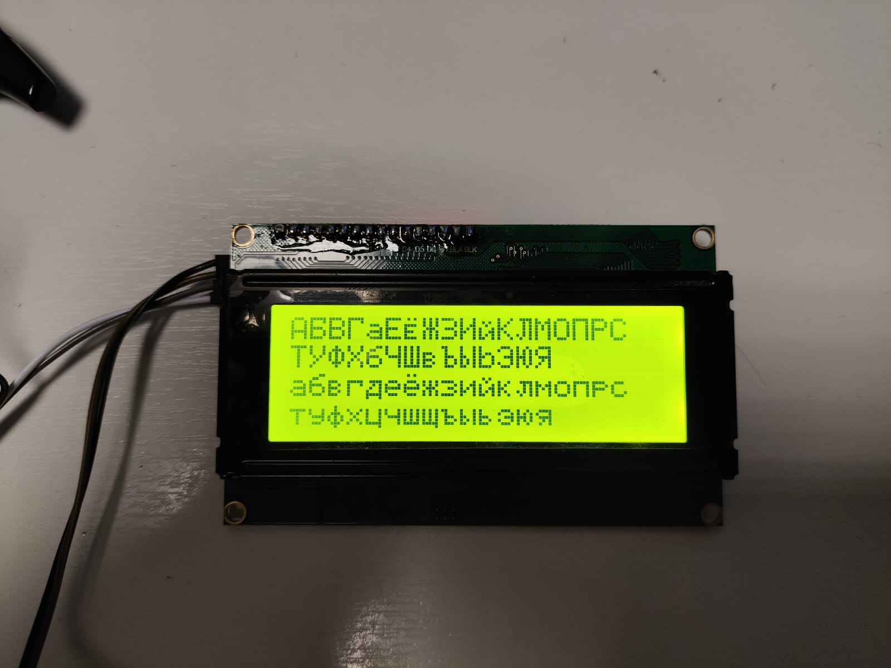
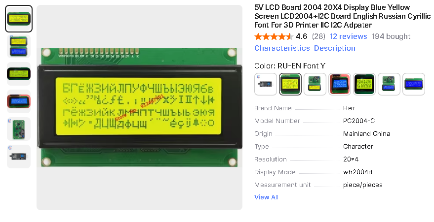
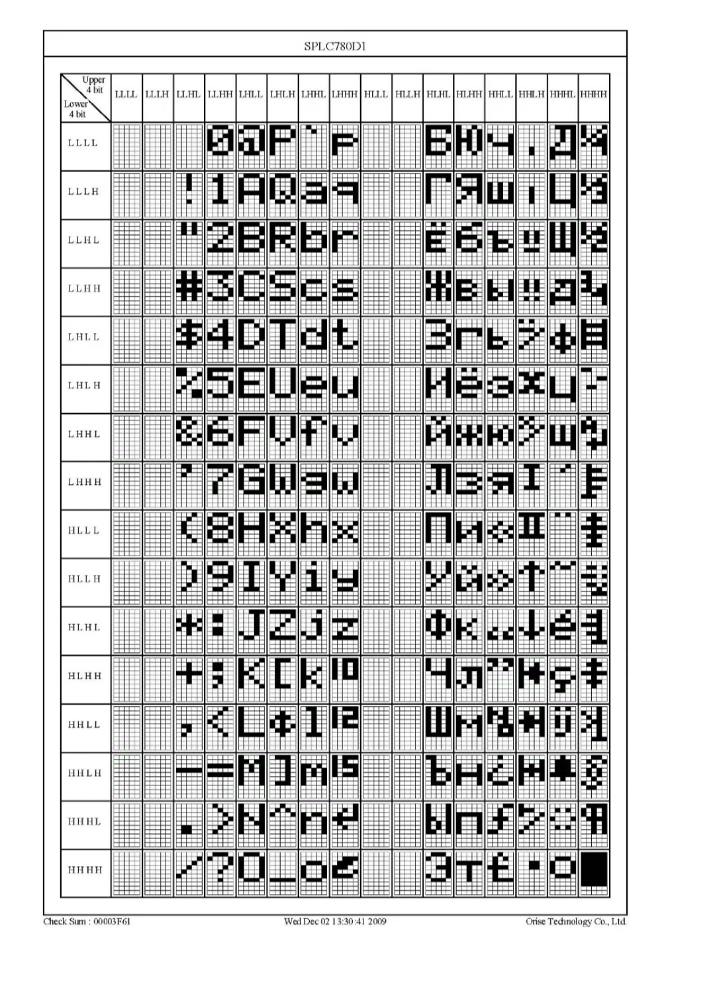

# Russian LCD Support

This demonstration uses the I2C LCD interface, can adapt to any LCD interface.  The LCD must support Russian characters.

# MUSTS - things you MUST DO

For LCD support with Russian character support you *must* use Windows-1251 encoding in GCBASIC IDE.

 

## LCD Specification

The LCD must support English Russian Cyrillic Fonts.

 

## Characters supported

The datasheet shows the characters and the index number.

 

