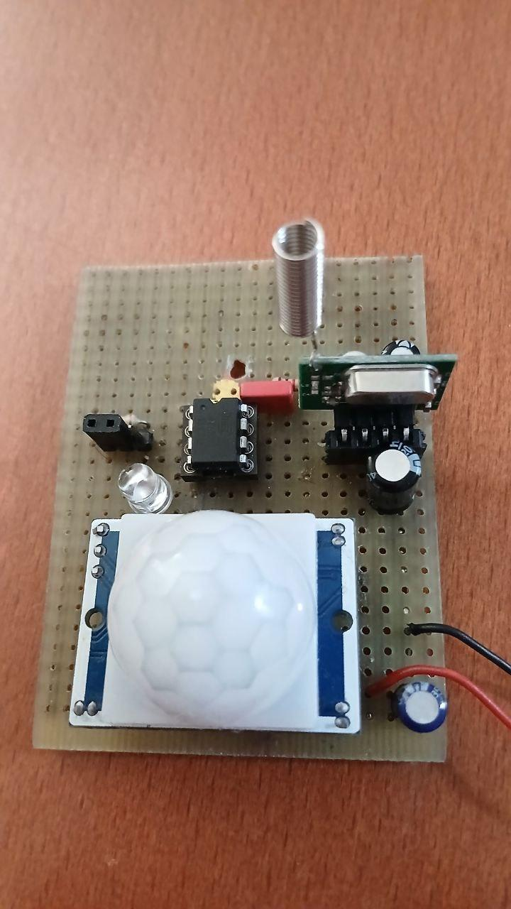
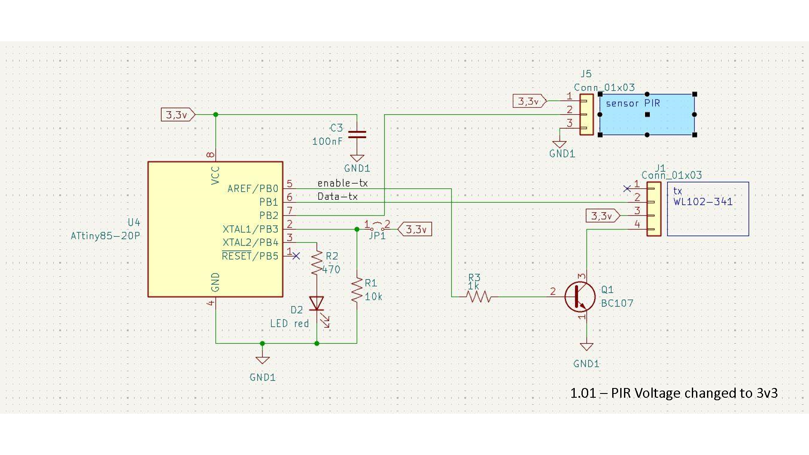

# Overview of WL102 PIR Sensor for ATTINY85 

This document provides an overview of a GCBASIC project demonstrating the use of a WL102 transmitter module interfaced with a PIR sensor and an ATTINY85 microcontroller. 
The code and discussion are sourced from a [SourceForge forum thread](https://sourceforge.net/p/gcbasic/discussion/629990/thread/e6d0ac4c99/).

## Project Description
The project, authored by user *Romtek*, showcases a low-power solution where an ATTINY85 microcontroller enters sleep mode and wakes up upon a PIR sensor trigger to transmit a predefined ASCII message ("DRTekTx1=1") via the WL102-341 module using ASK/OOK modulation. The code is written in GCBASIC and optimized for minimal power consumption, leveraging the ATTINY85’s sleep capabilities and interrupt-driven wake-up.

### Key Features
- **Microcontroller**: ATTINY85 running at 8 MHz.
- **Sensor**: PIR sensor connected to pin PB2 (PCINT2) for interrupt-based triggering.
- **Transmitter**: WL102-341 module for wireless communication using ASK/OOK modulation at a configurable baud rate (default: 300 baud, 3333 µs bit duration).
- **Power Management**: The ATTINY85 enters power-down mode to save energy, waking only when the PIR sensor detects motion.
- **Message Transmission**: Sends a 12-byte ASCII message (including CR and LF) three times upon trigger to ensure reliable communication.
- **Error Correction**: The schematic initially indicated a 5V power supply for the PIR sensor, but *Romtek* clarified it should be 3V to match communication levels.

### Code Highlights
- **Initialization**: Disables unnecessary peripherals (ADC, Timer0, Timer1, USI) to reduce power consumption.
- **Interrupt Handling**: Uses a Pin Change Interrupt (PCINT2) on PB2 to detect PIR sensor state changes, triggering the `risveglio` subroutine.
- **Transmission Routine**: Implements a software-based ASK/OOK modulation to send bytes, with a start bit, 8 data bits (LSB first), and a stop bit.
- **LED Feedback**: Blinks an LED (PB4) during startup and transmission for visual feedback, then sets it as input to save power.

### Schematic Notes
- The PIR sensor is connected to PB2 and powered at 3V (corrected from an initial 5V specification).
- The WL102 module is enabled via PB0 and transmits data through PB1.
- JP1 is currently unused.

## Receiver Component
The receiver implementation for the WL101 module, written for an Arduino Nano.

## Contributions
- **Romtek**: Provided the working GCBASIC code and schematic for the transmitter.

## Source
The code and discussion are available in the [SourceForge GCBASIC forum thread](https://sourceforge.net/p/gcbasic/discussion/629990/thread/e6d0ac4c99/).