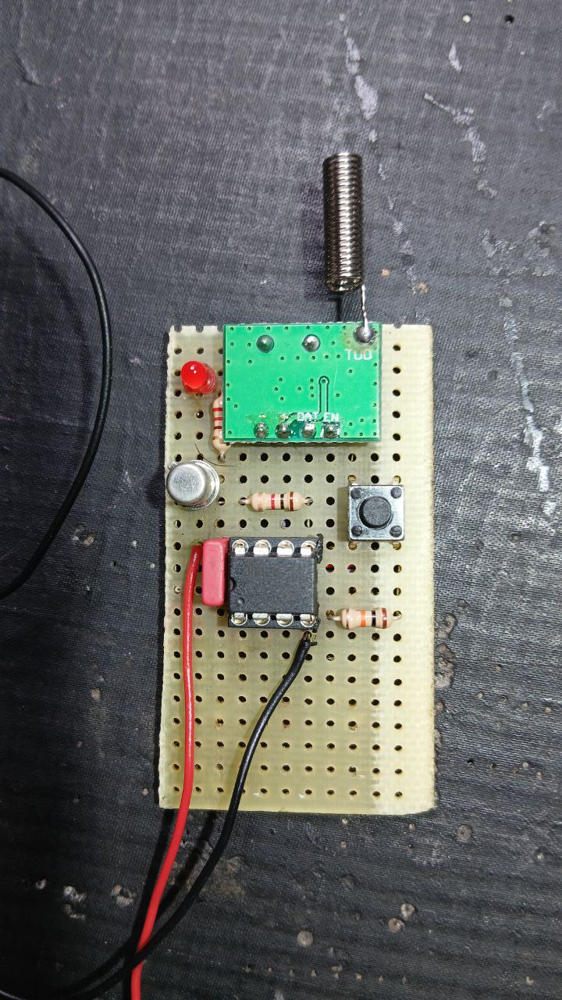

= ASK-OOK Transmitter and Receiver Project
:author: Romtek
:date: 2025-08-29
:revnumber: 0.1 (Transmitter), 0.7 (Receiver)
:revdate: 2025-08-29
:icons: font
:toc: left
:sectnums:
:xrefstyle: short

== Introduction
This project demonstrates an implementation of Amplitude Shift Keying - On-Off Keying (ASK-OOK) communication using low-cost WL101 (receiver) and WL102 (transmitter) modules interfaced with ATTINY85 microcontrollers.{nbsp}{nbsp}Operating at 433 MHz in ASK-OOK mode, the project comprises two components:

* **WL102 Transmitter**: Transmits a predefined string upon activation.{nbsp}{nbsp}See the GCBASIC source link:tx.gcb[here].
* **WL101 Receiver**: Receives the string, triggering an LED and an optional relay.{nbsp}{nbsp}See the GCBASIC source link:rx.gcb[here].

The objective is to provide a simple, low-power wireless communication example adaptable for various applications.

== Transmitter (WL102)

=== Overview
The transmitter, powered by a 3V battery, remains in a low-power state until activated.{nbsp}{nbsp}Pressing a button wakes the ATTINY85 microcontroller, which activates transistor Q1 to ground the WL102 module's power pin and illuminate an LED.{nbsp}{nbsp}The microcontroller then sends a predefined string via pin 6 (Data-TX) before returning to standby mode.

=== Hardware Configuration
- **Power Supply**: 3V battery
- **Microcontroller**: ATTINY85
- **Module**: WL102 transmitter (433 MHz, ASK-OOK)
- **Transistor**: Q1 (grounds the WL102 power pin)
- **LED**: Indicates transmission status
- **Button**: Connected to pin 7 (PB2) for triggering transmission

=== Operation
1. In standby, the transmitter consumes minimal power.
2. Pressing the button wakes the microcontroller.
3. The microcontroller activates Q1, powering the WL102 module and LED.
4. A predefined string (e.g., "DRTekTx1=1") is transmitted via pin 6.
5. The system returns to low-power standby mode after transmission.

=== Transmitter Diagram

*Physical Implementation*

== Receiver (WL101)

=== Overview
The receiver operates at 12V, reduced to 5V via a voltage regulator.{nbsp}{nbsp}Upon receiving the transmitted string, it activates an LED and can trigger an optional relay (not included in this demo).

=== Hardware Configuration
- **Power Supply**: 12V, reduced to 5V via a voltage regulator
- **Microcontroller**: ATTINY85
- **Module**: WL101 receiver (433 MHz, ASK-OOK)
- **LED**: Connected to pin 3 (PB4) for status indication
- **Optional Relay**: Configurable via JP1 for bistable operation (not used in demo)

=== Operation
1. The receiver continuously monitors for ASK-OOK signals.
2. Upon receiving the string "DRTekTx1=1", the LED on pin 3 lights layer for 500 ms.
3. The string buffer is reset after processing.
4. A jumper (JP1) allows for future bistable relay configurations.

=== Receiver Diagram

*Physical Implementation*

== Notes and Improvements
- **Receiver**: The JP1 jumper supports future bistable relay configurations but is unused in this demo.
- **Firmware**: The current implementation is basic.{nbsp}{nbsp}Enhancements could include error checking, advanced power management, or support for multiple message formats.
- **Extensibility**: The code serves as a foundation for applications like remote control systems or sensor data transmission.

== ASK-OOK Baud Rate Reference
The following table lists common baud rates and their bit durations for ASK-OOK communication:

|===
|Baud Rate |Bit Duration (µs) |Note
|300 |3333 |Very slow, high tolerance
|600 |1666 |Stable, moderate speed
|1200 |833 |Used in older modems
|2400 |416 |Good compromise
|4800 |208 |Faster, still stable
|9600 |104 |Standard TTL serial
|14400 |69 |High speed
|19200 |52 |Very high speed
|===

== Conclusion
This project offers a foundational example of ASK-OOK communication using low-cost hardware.{nbsp}{nbsp}The transmitter and receiver illustrate basic wireless communication principles, with potential for optimization and expansion.{nbsp}{nbsp}For complete schematics, code, and resources, refer to the project repository.

== References
- link:https://www.example.com/datasheets/wl101-wl102[WL101/WL102 Module Datasheets]
- link:https://www.example.com/docs/attiny85[ATTINY85 Microcontroller Documentation]
- link:https://www.example.com/repo/ask-ook-project[Project Repository]