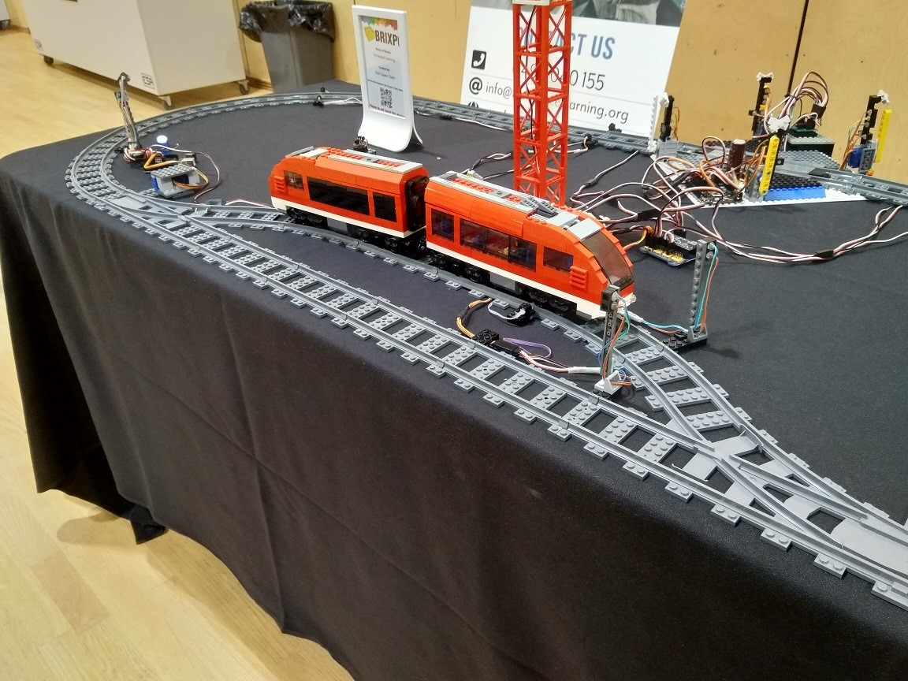

# 🚂 Lego Train Control System – Techspace Learning Demonstrator

This project showcases an interactive Lego train setup developed for **Techspace Learning**, a non-profit organization that teaches coding and electronics through Arduino-based workshops. Designed for exhibitions and workshops, the system brings together multiple Arduino clones and GCBASIC code to demonstrate coordination, automation, and serial communication in a fun and engaging way.

> 🔧 The core communication relies on a single shared pin used for both receiving (via hardware UART) and transmitting (bit-banged), highlighting an efficient messaging model across devices.

---


<p align="center">
  
</p>

## 🧠 System Overview

The system includes four coordinated Arduino modules, each responsible for a unique part of the train operation:

### 1️⃣ Master Controller
- **Sketch:** `Lego train with points serial crossing v3.gcb`
- **Role:** Central logic unit and original Arduino.
- **Features:**
  - Detects train position using phototransistors.
  - Controls two departure signals.
  - Sends IR commands to Lego Power Functions IR train.
  - Instructs other Arduinos via serial messaging.

### 2️⃣ Points Controller
- **Role:** Simplifies exhibit setup by offloading servo and signal control.
- **Features:**
  - Switches points via a servo motor.
  - Operates adjacent signal lights.
- **Connection:** Communicates with the master via a single 3-pin servo wire.

### 3️⃣ Emerson Crossing Controller
- **Model Inspiration:** Real-world Emerson Crossing in Adelaide.
- **Features:**
  - Controls traffic lights for two road directions.
  - On train approach: lowers four boom gates, flashes crossing lights, plays bell sounds.

### 4️⃣ User Interface LNP (Lap Number Picker)
- **Role:** Engages visitors interactively.
- **Features:**
  - Button and 7-segment display interface.
  - Button presses set desired lap count.
  - Sends lap instructions to the master.
- **Note:** Originally integrated with the master, now independent for cable efficiency.

---

## 🧪 LNP Protocol Details

A simplified yet robust communication system modeled after the original BrickOS protocol (used for Lego RCX). The LegOS Network Protocol (LNP) provides an integrity layer and uses packets parsed by a state machine for reliability.

### ⚙️ Configuration
- **Baud Rate:** 19200 bps (8 data bits, odd parity)
- **Physical Layer:**
  - RX pin used for both TX and RX (bit-banging for TX)
  - USB-to-serial chip pulls RX high via 1k resistors

### 🔁 Packet Structure
- Begins with `0xF0`, followed by byte count, data, and checksum
- Parser resets on incorrect parity
- Max reliable throughput: ~340 message pairs/sec

### 🧭 Message Format
- **Sent in address-status pairs**

| Address | Direction            | Purpose                                  |
|--------:|----------------------|------------------------------------------|
| 1       | Controller → Crossing | 0 = open gates; other = stop traffic     |
| 2       | Crossing → Controller | Bitmapped status (gates/road activity)   |
| 3       | Controller → Points   | Signal and diverging state control       |
| 4       | Points → Controller   | Signal and diverging status              |
| 5       | Controller → UI       | Commands or 7-segment bitmap             |
| 6       | UI → Controller       | Lap count and timeout bit                |
| 240     | Controller → PC       | Two-byte lap count update                |
| 241     | Controller → Clear    | Requires status byte `0xC1`              |
| 242     | PC/Controller → UI    | Configure timeout and lap count          |

### ⏱ Send Frequency
- Emerson Crossing: every 500 ms
- Points Controller: every 500 ms
- UI Button Unit: every 250 ms

### 💻 RealTerm Sample Commands

- Set lap count to 5:
  ```
  0xF0 4 242 0x03 0xE8 0x05 0xD5
  ```
- Start 9 laps:
  ```
  0xF0 2 6 0x89 0x80
  ```
- Train approaching Emerson Crossing:
  ```
  0xF0 2 1 1 0xF3
  ```
- Stop Emerson Crossing noise:
  ```
  0xF0 2 1 0 0xF2
  ```

---

## 📚 Acknowledgements

Created and maintained by Evan, incorporating creative hardware and software solutions to support **Techspace Learning** and its mission to teach tech through play and real-world modeling.

---

## 💡 Future Enhancements

- Modularize display logic for other types of train behaviors.
- Add wireless or RFID-based train tracking.
- Implement a web-based UI for monitoring lap counts and diagnostics.

---

## 📬 Contact

For inquiries, improvements, or collaboration:
**Techspace Learning** – [Insert contact or website if available]
