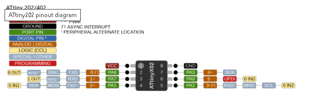

# Programming the ATtiny202 (8-pin)

This folder contains AVR DX / tinyAVR 0-series demo(s) for the **ATtiny202** (8-pin SOIC/SSOP, 2KB
flash, 128B SRAM), programmed and debugged via **UPDI**.



**PORTA.0 (PA0) is the UPDI pin.** On this chip PA0 is a shared pin, configurable via the
`SYSCFG0.RSTPINCFG` fuse as UPDI, external RESET, or plain GPIO. These demos are built and tested
with `RSTPINCFG = UPDI mode`, so PA0 is dedicated to the UPDI programming/debug connection and is
**not** available as a GPIO pin - only PA1, PA2, PA3, PA6, and PA7 are usable as general-purpose I/O
on the 8-pin package (see the Fuse configuration section below for the exact register values).

---

## Requirements
- ATtiny202 target (8-pin SOIC/SSOP)
- MPLAB PICkit4 programmer/debugger
- 3-wire UPDI connection: PICkit4 pin 2 -> target VDD, pin 3 -> target GND, pin 4 -> target UPDI
  (shared with the RESET/PA0 pin on this chip)
- GCStudio installed, with the `atprogram4` programmer profile below configured in `use.ini`

---

## Programmer setup used for testing

Tests were completed using a **PICkit4** with the following `use.ini` programmer profile:

```ini
[tool = atprogram4]
desc = ATMEL PICKit4 using UPDI
type = programmer
useif = DEF(AVR)
progconfig =
command = %atmelATPROGRAMdir%\ATprogram.exe
params = -t pickit4 -i UPDI -d AT%ChipModel%  chiperase program  -f "%FileName%"
workingdir = %atmelATPROGRAMdir%\
```

Set `ATMEL PICKit4 using UPDI` as the active programmer in Preferences Editor

Or,

```ini
[tool = atprogram5]
desc = Avrdude PICKit4 UPDI Mode
type = programmer
command = %GCSTUDIO_INSTALL_PATH%\avrdude\avrdude.exe
workingdir = 
params = -qq -c pickit4_updi -p AT%chipmodel% -P usb -U flash:w:"%filename%":i
useif = DEF(AVR)
progconfig = 
```

Set `Avrdude PICKit4 UPDI Mode` as the active programmer in Preferences Editor


### Tested hardware

| Field | Value |
|---|---|
| Tool | MPLAB PICkit 4 |
| Debug host | 127.0.0.1 |
| Debug port | 56365 |
| Serial number | BUR225173831 |
| Connection | com.atmel.avrdbg.connection.cmsis-dap |
| Features | 1 |
| Firmware Version | 1.0e |
| Hardware Version | 6 |

### Fuse configuration used for testing

| Fuse Name | Value |
|---|---|
| BODCFG.ACTIVE | Disabled |
| BODCFG.LVL | 1.8 V |
| BODCFG.SAMPFREQ | 1kHz sampling frequency |
| BODCFG.SLEEP | Disabled |
| OSCCFG.FREQSEL | 20 MHz |
| OSCCFG.OSCLOCK | unchecked (not locked) |
| SYSCFG0.CRCSRC | Disable CRC |
| SYSCFG0.EESAVE | checked (preserve EEPROM on chip erase) |
| SYSCFG0.RSTPINCFG | UPDI mode |
| SYSCFG1.SUT | 64 ms |
| TCD0CFG.CMPA/CMPAEN/CMPB/CMPBEN/CMPC/CMPCEN/CMPD/CMPDEN | all unchecked |
| WDTCFG.PERIOD | Watch-Dog timer Off |
| WDTCFG.WINDOW | Window mode off |

Raw fuse register bytes:

| Fuse Register | Value |
|---|---|
| APPEND | 0x00 |
| BODCFG | 0x00 |
| BOOTEND | 0x00 |
| OSCCFG | 0x02 |
| SYSCFG0 | 0xF7 |
| SYSCFG1 | 0x07 |
| TCD0CFG | 0x00 |
| WDTCFG | 0x00 |

Note: `SYSCFG0.RSTPINCFG = UPDI mode` dedicates PA0 to UPDI - it is not available as GPIO or external
reset under this configuration. Combined with PA4/PA5 not existing on the 8-pin package, only PA1,
PA2, PA3, PA6, and PA7 are usable as GPIO (exactly the 5 LEDs wired for `70_led_flash_multi_pattern.gcb`).

### Important: required PICkit4 firmware

This UPDI setup goes through `ATprogram.exe` (the Atmel/Microchip Studio backend), **not**
`ipecmd.exe`/MPLAB IPE. For `ATprogram.exe` to recognise and drive the PICkit4 (`-t pickit4`), the
PICkit4 must be running the firmware image loaded by **Microchip Studio**, not the firmware MPLAB X
loads onto it. A PICkit4 that was last used from MPLAB X will not work with this profile until its
firmware is switched back by connecting it to Microchip Studio at least once - swapping between the
two environments re-flashes the tool's own firmware each time, so keep this in mind if the same
PICkit4 is shared between MPLAB X (PIC) work and this UPDI (AVR) workflow.

### A note on Arduino's pin naming

If you're coming from the Arduino world (e.g. via SpenceKonde's **megaTinyCore**), be aware Arduino
does **not** use the same pin-naming convention as GCBASIC/native AVR does here. This demo addresses
pins directly by their real hardware name - `PORTA.6`, `PORTA.7`, `PORTA.1`, `PORTA.2`, `PORTA.3` -
matching the datasheet and the physical pin numbers. Arduino instead assigns its own sequential
logical "digital pin" numbers, which do **not** match the `PAx` bit number:

| Native AVR pin | Arduino digital pin | Notes |
|---|---|---|
| PA6 | D0 | |
| PA7 | D1 | |
| PA1 | D2 | |
| PA2 | D3 | |
| PA3 | D4 | |
| PA0 | D5 | UPDI/RESET - not usable as GPIO under this fuse config |

So `digitalWrite(0, HIGH)` in an Arduino/megaTinyCore sketch drives the same physical pin as `Set
PORTA.6 On` does here - but the numbers themselves (`0` vs `PORTA.6`) have no direct relationship, and
mixing up the two conventions when translating a demo/wiring diagram between GCBASIC and Arduino is
an easy mistake to make. Always cross-check against the physical pin or the datasheet pinout, not
just a bare digital pin number, when working between the two.

---

## Alternative programmer: turn an Arduino into a UPDI programmer (jtag2updi)

If a PICkit4 isn't available, an Arduino Uno/Nano (or any ATmega328p/168p board) can be turned into a
UPDI programmer for the ATtiny202 using the **jtag2updi** firmware (by ElTangas). It runs on the
Arduino's own MCU and bridges `avrdude` to the UPDI target:


```
avrdude -> HW Serial -> Programmer MCU (e.g. ATmega328P) -> SW Serial (PD6) -> Target MCU (ATtiny202)
```

Notes:
- The Arduino board's auto-reset feature must be disabled first (shorting/removing the reset-enable
  capacitor, or the equivalent technique for the board) or the host resetting the programmer mid-session
  will break the connection.
- jtag2updi has been officially tested on tinyAVR 0-series/1-series parts and the ATmega328p/168p, but
  is widely reported to also work on classic megaAVR x8/x4/x1/x0 parts, megaAVR 0-series, and AVR-DA
  parts.
- Older versions were prone to freezing if the target wasn't connected correctly, or if a slow host
  command (e.g. reading a full flash) was interrupted - current versions add timeouts on both the
  host and target sides of the link to recover from this instead of requiring a manual reset.
- This is a good low-cost fallback to the PICkit4/`atprogram4` setup documented above, or to the
  SerialUPDI (USB-serial + resistor) approach - useful if neither a PICkit4 nor a spare USB-serial
  adapter is on hand, but an Arduino is.

---

## Troubleshooting Tips
- **"Failed to get Device ID" / Connection Failed**: usually means the UPDI pin (PA0) has been fused
  away from UPDI mode, or the programming speed is too high for the wiring. In the tool's
  Communication properties, try enabling **UPDI High Voltage Activation** and/or lowering the
  **Program Speed** to Low.
- **PICkit4 not recognised by `ATprogram.exe`**: see the firmware note above - reconnect the PICkit4
  to Microchip Studio once to restore its UPDI-compatible firmware.

---

## References
- [https://miraluna.hatenablog.com/entry/tiny202](https://miraluna.hatenablog.com/entry/tiny202)
