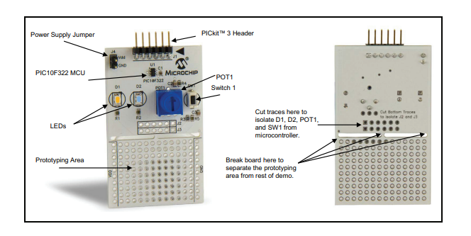
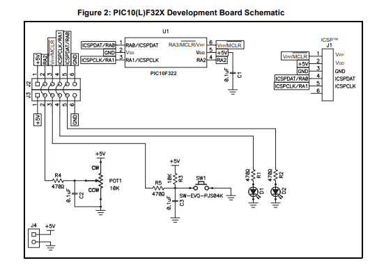

# PIC10F322 ADC-Controlled PWM LED Dimmer

**Board / Firmware Reference Documentation**

---

## 1. Overview

This board uses a Microchip **PIC10F322** 8-bit microcontroller to read an analog
voltage (from a potentiometer or other analog source) on pin **AN2 (RA2)** and use
that reading to directly drive the on-chip **PWM1** peripheral, producing a
variable-brightness output on **RA0**. A secondary GPIO toggle on **RA1** provides
a visual "heartbeat" indicator that the main loop is running.

| Parameter | Value |
|---|---|
| MCU | PIC10F322 (6-pin SOT-23 / 8-pin DFN) |
| Core | 8-bit Enhanced Mid-Range PIC |
| Program Memory | 512 words (896 bytes) Flash |
| Data (RAM) Memory | 64 bytes |
| Clock Source | Internal HFINTOSC, forced to 16 MHz |
| PWM Frequency | ~25.97 kHz (target: 26 kHz) |
| ADC Resolution | 8-bit, 3 channels (AN0–AN2) |
| PWM Output Pin | RA0 |
| ADC Input Pin | RA2 (AN2) |
| Debug/Heartbeat Pin | RA1 |
| Firmware Language | GCBASIC |

**Board reference:** Microchip **DS41613A**, *PIC10(L)F32X Development Board
Quick Start Guide* (board part number **DEV-AC103011**).

**MCU register/peripheral reference:** Microchip **DS40001585D**, *PIC10(L)F320/322
6/8-Pin Flash-Based, 8-Bit Microcontrollers* datasheet.

> DS41613A documents the physical development board this firmware targets — its
> layout, factory-loaded demo behavior, and schematic — but it does not contain
> detailed peripheral register descriptions. Those come from the full MCU
> datasheet, DS40001585D, and are cited throughout Section 4 below.

### 1.1 Factory Overview (DS41613A, verbatim)

> **Overview**
> The PIC10(L)F32X Development Board is programmed at the factory with a
> demonstration program. The board does not need to be configured in any way in
> order to use the demonstration program. Once the board is powered up, the
> brightness of LED (D2) may be varied using the potentiometer (POT1). LED (D1)
> is powered as long as the PIC10F322 device is operating, and will thus vary
> with the supply voltage.
>
> **Board Setup**
> There is no setup for this demo board to operate.
>
> **Board Power-Up**
> Supply power to the board in one of the following ways:
> - Connect a 2.3-5 VDC supply using J4 (see Figure 1).
> - Use the power supplied by the PICkit™ 3 or MPLAB™ ICD 3 programmers.
>
> **Demonstration Program**
> After applying power to the PIC10(L)F32X Development Board, LED (D1) will
> automatically turn on. Turn POT1 clockwise to increase the brightness of LED
> (D2). Press switch (SW1) to turn both LEDs D1 and D2 off, release switch (SW1)
> and LEDs D1 and D2 will turn on.
>
> **Board Layout**
> The PIC10(L)F32X Development Board is shown in Figure 1 and a schematic in
> Figure 2. A PIC10F322 microcontroller is populated on the top center of the
> demo board under the identification label U1. The PIC10F322 has 4 available
> I/O pins that are initially connected to the four major components on the
> board. The initial connections connect to the following components:
> - Switch 1 (SW1) – 1 pin: MCLR (pin 6) of microcontroller
> - Pot 1 (POT1) – 1 pin: RA2 (pin 4) of microcontroller
> - LED (D1) – 1 pin: RA1 (pin 3) of microcontroller
> - LED (D2) – 1 pin: RA0 (pin 1) of microcontroller
>
> Should you choose to use the board to experiment on your own, the board allows
> the flexibility to do so. A prototyping area is provided, with ground (GND)
> and supply voltage (VDD) connections on the left and right sides, to expand
> and experiment with the capabilities of the PIC10(L)F32X Development Board.

This firmware **repurposes the factory demo wiring** rather than following its
exact behavior: RA0/D2 becomes a PWM-dimmed output (instead of factory PWM
dimming logic), RA2/POT1 still drives the analog input as originally wired, and
RA1/D1 is used as a loop heartbeat rather than a simple power-on indicator. See
Section 8 regarding SW1/RA3, which the factory demo reads as an input but this
firmware currently leaves configured as an output.

<!-- PLACEHOLDER: Figure 1 — Photo of the PIC10(L)F32X Development Board -->
 
> 🖼️ **Figure 1 — PIC10(L)F32X Development Board (photo)**
> *[Insert board photo here — shows J4 power jumper, PICkit™ 3 header, POT1,
> SW1, LEDs D1/D2, the U1 PIC10F322, and the prototyping area, per DS41613A.]*

<!-- PLACEHOLDER: Figure 2 — PIC10(L)F32X Development Board schematic -->
 
> 🖼️ **Figure 2 — PIC10(L)F32X Development Board Schematic**
> *[Insert circuit schematic here — shows SW1 on RA3/MCLR/VPP (pin 6), POT1 on
> RA2 (pin 4), D1 on RA1 (pin 3), D2 on RA0 (pin 1), plus the VDD/VSS and ICSP™
> connections, per DS41613A Figure 2.]*

---

## 2. Pinout — DEV-AC103011 Board (per DS41613A Schematic)

| Pin # | Name | Board Component | Function Used in This Firmware |
|---|---|---|---|
| 1 | RA0 | **LED D2** | **PWM1 output** — dimmable LED |
| 2 | VSS | — | Ground |
| 3 | RA1 | **LED D1** | Heartbeat/debug GPIO output (toggles each loop); on the factory demo, D1 simply indicates the MCU is powered |
| 4 | RA2 | **POT1** | **AN2** — analog input from the on-board potentiometer |
| 5 | VDD | — | Supply (2.3V–5.5V for PIC10F322, 1.8V–3.6V for PIC10LF322) |
| 6 | RA3/MCLR/VPP | **SW1** | General I/O (Reset function disabled via `MCLRE = OFF`) / ICSP programming voltage |

The board's factory-loaded demo uses this same wiring: turning POT1 clockwise
brightens D2, and pressing SW1 turns both D1 and D2 off (release restores them).
This custom firmware repurposes that layout — D2/RA0 becomes the PWM-dimmed
output driven by the pot on RA2, and D1/RA1 is used as a loop-heartbeat rather
than a straightforward power indicator.

RA3 is usable as general I/O (rather than a Reset input) because **MCLRE = OFF**
in the configuration word disables its Reset function — but see the note in
Section 8 regarding this pin's direction setting in the current firmware.

---

## 3. Configuration Word

```
#config MCLRE = OFF, FOSC = INTOSC, WDTE = OFF, PWRTE = ON, CP = OFF, BOREN = OFF
```

| Bit | Setting | Effect |
|---|---|---|
| MCLRE | OFF | RA3 is a normal I/O pin, not a Reset input |
| FOSC | INTOSC | Internal oscillator used as system clock (no crystal needed) |
| WDTE | OFF | Watchdog Timer disabled |
| PWRTE | ON | Power-up Timer enabled — brief delay after power-on before code runs, letting supply voltage stabilize |
| CP | OFF | Code protection off — Flash is readable/programmable |
| BOREN | OFF | Brown-out Reset disabled |

---

## 4. Peripheral Register Summary

### 4.1 I/O Direction — `TRISA`

```
Dir PORTA Out
Dir PORTA.2 In
```

All PORTA pins default to outputs; RA2 is overridden to an input so it can serve
as the AN2 analog channel.

### 4.2 Analog Select — `ANSELA`

```
ANSELA = 0b00000100     ' ANSA2 = 1 -> RA2 (AN2) set to analog mode
```

Setting `ANSA2` disables RA2's digital input buffer and connects it to the ADC
sample-and-hold circuit. All other `ANSELx` bits remain 0, keeping RA0/RA1/RA3
digital.

### 4.3 ADC Control — `ADCON`

Unlike larger PIC parts, the PIC10F322 uses a **single combined `ADCON` register**
(address `0x1F`) rather than separate `ADCON0`/`ADCON1`:

| Bit | 7 | 6 | 5 | 4 | 3 | 2 | 1 | 0 |
|---|---|---|---|---|---|---|---|---|
| Name | ADCS2 | ADCS1 | ADCS0 | CHS2 | CHS1 | CHS0 | GO/DONE | ADON |

```
' GO_nDONE stop; ADON enabled; ADCS FOSC/2; CHS AN0;
ADCON = 0x01 | ( 0b010 << 2)
```

This evaluates to `0b00001001` (`0x09`):

| Field | Value | Meaning |
|---|---|---|
| ADCS<2:0> | `000` | Conversion clock = Fosc/2 |
| CHS<2:0> | `010` | Channel 2 selected = **AN2** (the inline comment "CHS AN0" in the source is a mislabel — the shifted value actually selects AN2, matching the RA2 pot input) |
| GO/DONE | `0` | No conversion in progress at startup |
| ADON | `1` | ADC module powered on |

### 4.4 PWM Control — `PWM1CON`

```
' PWM1POL active_hi; PWM1OE enabled; PWM1EN enabled;
PWM1CON = 0xC0;   ' 0b11000000
```

| Bit | Name | Value | Meaning |
|---|---|---|---|
| 7 | PWM1EN | 1 | PWM1 module enabled |
| 6 | PWM1OE | 1 | PWM1 output driver enabled onto RA0 |
| 5 | PWM1OUT | — | Read-only output state bit |
| 4 | PWM1POL | 0 | Active-high output polarity |

### 4.5 PWM Duty Cycle — `PWM1DCH` / `PWM1DCL`

The 10-bit PWM duty value is split across two registers:

- **PWM1DCH<7:0>** — 8 most-significant bits (updated every loop from the ADC result)
- **PWM1DCL<7:6>** — 2 least-significant (fractional) bits; bits 5:0 are unimplemented

```
PWM1DCH = 0;       ' Duty starts at 0 (output off at power-up)
PWM1DCL = 0x15;    ' 0b00010101 -> bits 7:6 = 00, so fractional LSBs = 0
```

### 4.6 PWM Period — `PR2`

```
' PR2 = 153 -> Fpwm = 16MHz / (4 x (153+1) x 1) = 25.97 kHz (~26 kHz)
' Note: duty resolution is now 0-153, not the full 0-255
PR2 = 153
```

The PWM period register sets both the switching frequency and the effective duty
resolution. With **PR2 = 153**, `PWM1DCH` values above 153 saturate the output at
100% duty rather than continuing to increase.

### 4.7 Timer2 Control — `T2CON`

```
' T2CKPS 1:1; TOUTPS 1:1; TMR2ON on;
T2CON = 0b00000100
```

| Field | Value | Meaning |
|---|---|---|
| TOUTPS<3:0> | `0000` | Postscaler 1:1 |
| TMR2ON | `1` | Timer2 running (drives the PWM/ADC time base) |
| T2CKPS<1:0> | `00` | Prescaler 1:1 |

### 4.8 Oscillator — `OSCCON`

```
OSCCON = 112   ' 0b01110000
```

| Field | Value | Meaning |
|---|---|---|
| PLL enable (bit 7) | 0 | 4x PLL disabled |
| IRCF<2:0> (bits 6:4) | `111` | HFINTOSC = 16 MHz |

This is applied via a custom `InitSys` override so the clock is locked to 16 MHz
before `Main` begins, guaranteeing the PWM frequency and ADC timing calculations
above hold true.

---

## 5. PWM Frequency / Resolution Trade-off

```
Fpwm = Fosc / (4 x (PR2 + 1) x TMR2 prescaler)
     = 16,000,000 / (4 x 154 x 1)
     = 25,974 Hz  (~25.97 kHz)
```

Because `PR2 = 153` rather than the maximum `255`, the full 0–255 ADC range is
**not** linearly mapped across the whole PWM duty range — readings above 153 all
produce 100% duty. If a smoothly linear 0–100% response across the entire pot
sweep is required instead, scale the ADC result before writing it:

```
PWM1DCH = ADRES * 153 / 255
```

The working firmware below uses the direct (unscaled) assignment, which gives
finer control in the lower/middle portion of the pot's travel at the cost of an
early-saturating top end.

---

## 6. Complete Firmware (GCBASIC)

```basic
'==============================================================================
' PIC10F322 - ADC-Controlled PWM LED Dimmer
'------------------------------------------------------------------------------
' Function : Reads a potentiometer/analog voltage on AN2 (RA2) and uses the
'            8-bit result to directly set PWM duty cycle, driving an LED (or
'            other load) at a brightness proportional to the ADC reading.
'
' PWM output : RA0  (PWM1 peripheral output pin on the 10F322)
' ADC input  : AN2  (RA2) - configured as analog input
' Heartbeat  : RA1 toggles opposite of RA3 each loop (visual "alive" indicator
'              / debug pin - has no effect on the PWM/ADC function itself)
'
' Clock      : Forced to 16 MHz HFINTOSC via custom MyInitSys (see bottom)
' PWM freq   : ~25.97 kHz (target: 26 kHz)
'==============================================================================

#chip 10F322
#config MCLRE = OFF, FOSC = INTOSC, WDTE = OFF, PWRTE = ON, CP = OFF, BOREN = OFF
' MCLRE = OFF  -> RA3 is a general I/O pin, not a Reset input
' FOSC = INTOSC-> internal oscillator used as system clock (no external crystal)
' WDTE = OFF   -> Watchdog Timer disabled (no auto-reset if code hangs)
' PWRTE = ON   -> Power-up Timer enabled (short delay after power-on for
'                 supply voltage to stabilise before code starts)
' CP = OFF     -> Code protection off (flash is readable/programmable)
' BOREN = OFF  -> Brown-out Reset disabled

'------------------------------------------------------------------------------
' I/O DIRECTION SETUP
'------------------------------------------------------------------------------
Dir PORTA Out        ' All PORTA pins default to outputs...
Dir PORTA.2 In        ' ...except RA2, which is overridden to input (for AN2)

    '--------------------------------------------------------------------------
    ' ADC CONFIGURATION
    '--------------------------------------------------------------------------
    ANSELA = 0b00000100     ' ANSA2 = 1 -> RA2 (AN2) set to analog mode

    ' ADCON (single combined register on the 10F322, address 0x1F):
    '   bit7:5 = ADCS<2:0>  A/D conversion clock select
    '   bit4:2 = CHS<2:0>   Analog channel select
    '   bit1   = GO/DONE    Conversion start/status flag
    '   bit0   = ADON       ADC module enable
    ' ADCON = 0x01 | (0b010 << 2) = 0b00001001 (0x09)
    '   ADCS<2:0> = 000  -> Fosc/2 conversion clock
    '   CHS<2:0>  = 010  -> Channel 2 = AN2 (RA2)
    '   GO/DONE   = 0    -> no conversion in progress yet
    '   ADON      = 1    -> ADC module powered on
    ' GO_nDONE stop; ADON enabled; ADCS FOSC/2; CHS AN0;
    ADCON = 0x01 | ( 0b010 << 2)

    '--------------------------------------------------------------------------
    ' PWM CONFIGURATION (PWM1 peripheral, output on RA0)
    '--------------------------------------------------------------------------
    ' PWM1CON = 0xC0 = 0b11000000
    '   PWM1EN  = 1  -> PWM1 module enabled
    '   PWM1OE  = 1  -> PWM1 output driver enabled onto its pin (RA0)
    '   PWM1POL = 0  -> Active-high output (duty cycle = % time HIGH)
    // PWM1POL active_hi; PWM1OE enabled; PWM1EN enabled;
    PWM1CON = 0xC0;

    PWM1DCH = 0;       ' Duty cycle MSBs start at 0 (LED off at power-up)
    PWM1DCL = 0x15;    ' 0x15 = 0b00010101 -> only bits 7:6 matter (=00)

    ' --- PR2 = 153 -> Fpwm = 16MHz / (4 x (153+1) x 1) = 25.97 kHz (~26 kHz) ---
    ' --- Note: duty resolution is now 0-153, not the full 0-255, so the ---
    ' --- ADC's 8-bit result (0-255) must be scaled down to fit this range ---
    PR2 = 153

    // T2CKPS 1:1; TOUTPS 1:1; TMR2ON on;
    T2CON = 0b00000100

    '--------------------------------------------------------------------------
    ' MAIN LOOP
    '--------------------------------------------------------------------------
    Do
        ' --- Start ADC conversion ---
        SET GO_NOT_DONE ON   ' Sets ADCON bit1 (GO/DONE) = 1, triggering a
                              ' new A/D conversion on the selected channel (AN2)

        NOP                  ' 3 NOP delay: gives the conversion a couple of
        NOP                  ' instruction cycles' head start before polling
        NOP

        Wait While GO_NOT_DONE ON
                              ' Poll ADCON bit1: hardware clears GO/DONE
                              ' automatically the instant conversion completes.

        PWM1DCH = ADRES       ' Copy the completed 8-bit ADC result (0-255)
                              ' directly into the PWM duty MSB register.
                              ' NOTE: since PR2=153, any ADRES value above 153
                              ' saturates the PWM at 100% duty. For a linear
                              ' 0-255 -> 0-153 mapping instead, use:
                              '   PWM1DCH = ADRES * 153 / 255

        PORTA.1 = !PORTA.3    ' Heartbeat/debug toggle - not required for
                              ' PWM/ADC operation.
    Loop

End

'------------------------------------------------------------------------------
' CLOCK OVERRIDE
'------------------------------------------------------------------------------
' Custom InitSys override replaces GCBASIC's default startup routine and explicitly
' sets the oscillator to run at 16 MHz before Main begins.
#define  InitSys MyInitSys
Sub MyInitSys
    ' OSCCON = 112 = 0b01110000
    '   bit7      = 0    -> 4x PLL disabled
    '   IRCF<2:0> = 111  -> HFINTOSC = 16 MHz (bits 6:4)
    OSCCON = 112
End Sub
```

---

## 7. Register Value Quick Reference

| Register | Value | Purpose |
|---|---|---|
| `TRISA` | RA2 input, rest output | I/O direction |
| `ANSELA` | `0b00000100` | RA2 set to analog (AN2) |
| `ADCON` | `0x09` | Fosc/2 clock, channel = AN2, ADC on |
| `PWM1CON` | `0xC0` | PWM1 enabled, output driven, active-high |
| `PWM1DCL` | `0x15` | Fractional duty LSBs (effectively 0) |
| `PR2` | `153` | Sets ~25.97 kHz PWM frequency |
| `T2CON` | `0b00000100` | Timer2 on, 1:1 prescale/postscale |
| `OSCCON` | `112` | Locks internal oscillator to 16 MHz |

---

## 8. Known Limitations / Notes for Future Revisions

- **Resolution vs. frequency trade-off:** `PR2 = 153` was chosen to hit ~26 kHz at
  16 MHz, which caps usable PWM resolution at 0–153 rather than the full 0–255.
  Raising `PR2` toward 255 increases resolution but lowers frequency below 26 kHz
  (max full-resolution frequency at 16 MHz is 15.625 kHz).
- **ADC clock (`ADCS = 000`, Fosc/2):** at 16 MHz this gives Tad = 125 ns. Confirm
  this remains within the device's minimum Tad specification (datasheet §22, A/D
  Conversion Requirements) if the oscillator speed is changed in a future revision.
