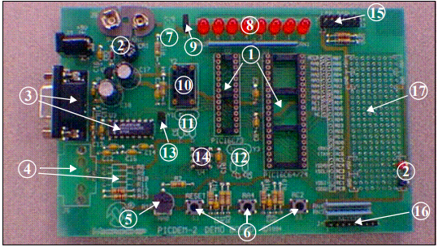
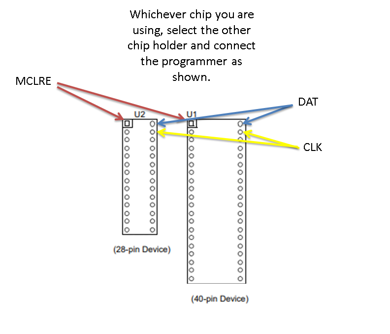

*PICDEM 2 Demo Board ©1994*

This is a great board this support the latest PICs.  

The PICDEM 2 demonstration board has the following hardware features:

1. 40- and 28-pin DIP sockets (Although 2 sockets are provided, only one
device may be used at a time.)
2. On-board +5V regulator for direct input from 9V, 100mA AC/DC wall
adapter or 9V battery, or hooks for a +5V, 100mA regulated DC supply.
3. RS-232C socket and associated hardware for direct connection to
RS-232C interface.
4. Unpopulated holes for Access.bus connector and associated
hardware.
5. 5K pot for devices with analog inputs.
6. Three push button switches for external stimulus and RESET.
7. Green power-on indicator LED.
8. Eight red LEDs connected to PORTB for displaying 8-bit binary values.
9. Jumper to disconnect LEDs from PORTB.
10. Socket for “canned” crystal oscillator.
11. Unpopulated holes provided for crystal connection.
12. Unpopulated holes provided for Timer1 external crystal.
13. Jumper to disconnect on-board RC oscillator (approximately 2 MHz).
14. 128 x 8 Serial EEPROM.
15. LCD module header.
16. Keyboard header.
17. Prototype area for user hardware.

*Programming*

To program use a PICKit2 or PICKit3 with PICKitPlus ( www.pickitplus.co.uk)

Connect the programming cable as follows:
    MLCRE - PORTE.3 ( top left pin of chip looking from top)
    VDD   - any VDD connector
    VSS   - 0v0 to any GND connector
    DAT   - PORTB.7 (Top right hand pin looking from the top)
    CLK   - PORTB.6 (Second from top right looking from the top)

*Demonstrations*

The demonstrations show how to use the following:
    
        A LCD as an 8Bit device or 4Bit device
        A KeyPad connected to J4
        LEDs 
        USART/Serial out on PORTC.6
        Switches as inputs
        ADC is analog input as 8bit or 10bit ADC
        External I2C EEProm

One demo brngs this items all together to create a passcode capability program - amazingly simple.

*An amazing board!*
    
