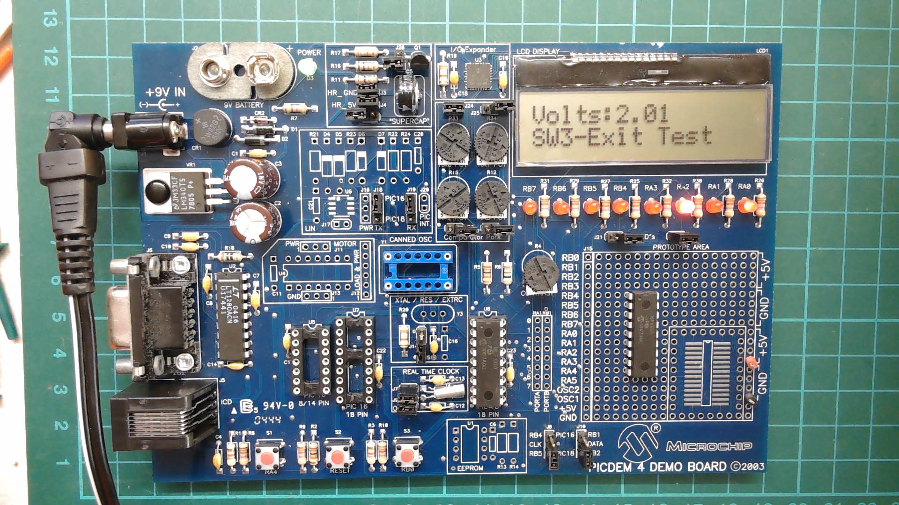

# Microchip PICDEM 4 Board 2003 with New LCD, PIC18F1320, and PIC16F648A

This Microchip PICDEM 4 Board 2003 is a versatile demonstration and evaluation board, perfect for developers and hobbyists alike. It includes the following features:

The original Microchip product description is here: [Microchip PICDEM 4 Board 2003](https://www.microchip.com/en-us/development-tool/dm163014)

#### Tested Microcontrollers:
- **PIC18F1320:** 8-pin, 18-pin DIP device with nanoWatt Technology, 8KB Flash program memory, 256 bytes RAM, 256 bytes EEPROM, and 10-bit A/D converter.
- **PIC16F648A:** 18-pin DIP device with 7KB Flash program memory, 256 bytes RAM, 256 bytes EEPROM, and various peripherals including USART, capture/compare/PWM, and 2 comparators.

#### Display:
- **LCD:** 2x16 character LCD display for easy data visualization and debugging.

#### Connectivity:
- **RS-232 Port:** Active RS-232 port for serial communication.
- **Prototyping Area:** Generous area for custom circuitry and experimentation.
- **MPLAB ICD 2 Connector:** For in-circuit debugging and programming.

#### Additional Features:
- **8 LEDs:** For status indication and debugging.
- **3 Push Button Switches:** For user input and control.
- **Master Reset:** For easy system reset.
- **Supercapacitor Circuitry:** For power management.
- **LIN Transceiver Area:** For LIN bus communication.
- **Motor Driver Area:** For motor control applications.

#### Operational Demonstrations:
Watch the attached video for operational demonstrations showcasing the capabilities of the PICDEM 4 Board 2003.

Check out this [YouTube video](https://www.youtube.com/watch?v=ZuW_LUatD-A) for more information.

#### Best Upgrade for PICAXE Users:
This is the best upgrade for PICAXE users. You can use your old 18Pin PICAXE microcontrollers and reprogram using PICKitPlus and GBCASIC to take advantage of all the features of the board and the microcontrollers! The easier way to move forward with your projects.

