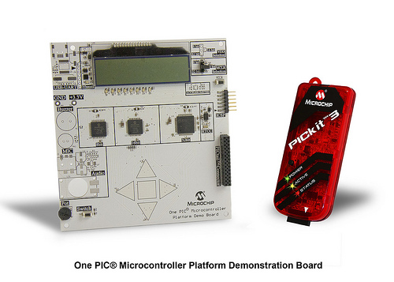

# Microchip PIC One Board Development Kit

  
*(onePicMicrocontrollerboard.jpg)*

Welcome to the GitHub repository for the **Microchip PIC One Board**, a versatile development board perfect for creating firmware with Microchip's 8/16/32-bit PIC® Microcontrollers. This repository provides resources, documentation, and examples to help you get started.

## Description

The Microchip PIC One Board is designed for engineers, students, and enthusiasts alike. With its preprogrammed firmware, it offers seamless operation of an LCD, LEDs, and capacitive touch pads, making your development experience efficient and enjoyable. Powered by a single AAA Ultimate Lithium battery, this board is lightweight, portable, and highly functional.

## Features

- **Integrated PIC® Microcontrollers**:
  - PIC16LF1939-I/PT
  - PIC24FJ256GA106-I/PT
  - PIC32MX795F512L-80I/PT
- **Capacitive Touch Pads** for intuitive user input.
- **Segmented LCD** for clear data visualization.
- **Colored LEDs** to enhance project interaction.
- **Single Cell Battery Supply** supported by MCP1640T-I/CH for efficient power management.
- **Real-Time Calendar Clock** featuring MCP79410-I/S.
- **Connectivity Options**:
  - PICkit™ 3 Connector
  - PICtail™ Board Connector

## Why Choose This Development Board?

Whether you're just starting out or are an experienced developer, the Microchip PIC One Board provides the flexibility and advanced features needed for:
- Prototyping innovative ideas
- Educational projects
- Commercial product development

It’s the perfect tool for exploring Microchip's PIC® ecosystem.

## Repository Contents

This repository includes the following files and resources:
- **Documentation**:
  - `1674426.pdf` – Detailed user guide for the board. *
  **Schematic**:
  - `PICOnePlatform_Schematic_03-02290_REV_1.pdf` – Detailed schematic guide for the board. *
- **Images**:
  - Three `.jpg` images showcasing the board and features:
    - `PIC_ONE_BOARD#1.jpg`
    - `PIC_ONE_BOARD#2.jpg`
    - `OnePICMicrontrolleEnergizer.jpg`
  - One `.gif` demonstrating the board in action:
    - `OnePICMicrontroller.gif`
- **Example Code**:
  - Sample project for 16LF1939 is in the folder.

## Getting Started

1. Clone the repository:
   ```bash
   git clone https://github.com/your-username/microchip-pic-one-board.git
